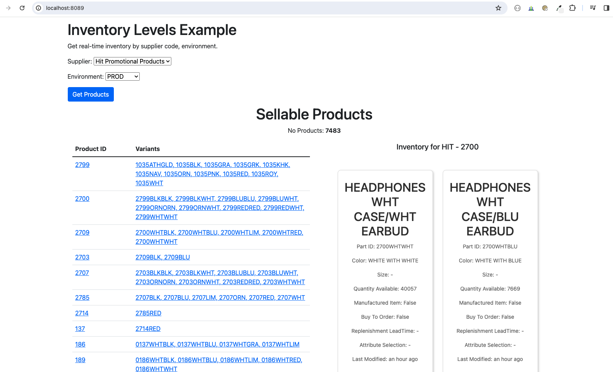

# Inventory Examples

# Two options:
- A FastAPI project to check inventory levels in real time
- A single html that will check inventory levels in real time(example of Public key usage)

## What is this code about?

This code is a FastAPI project that uses `PSRESTful API` to check order status.

We show step by step how to use `PSRESTful API` to check real-time inventory levels for a supplier implementing `PromoStandards`.

It is a simple example, but it shows how to use `PSRESTful API` to check real-time inventory for a supplier.

We used [Bootstrap](https://getbootstrap.com/) and [JQuery](https://jquery.com/) to make the UI more user-friendly and don't raise the complexity of the example.

But the main focus is on how to use `PSRESTful API` to use inventory API for a supplier. Not the UI.

We believe it will help you understand how easy is to integrate your backend to use `PSRESTful API` to check order 
status for all suppliers we support.

Even though our example is using Python, the example is easy enough to be ported to any other programming language.

## Installation

```bash
pyenv virtualenv inventory
pyenv activate inventory
pip install -r requirements.txt
```

## Before running the project

- Register in [PSRESTful](https://psrestful.com) and get the `API key`
- Create a .env file in the root directory of the project and add `PS_RESTFUL_KEY` variable with the API key value
- Enter your supplier passwords at least for one Supplier 
- Run `uvicorn main:app --port 8000 --host 127.0.0.1 --workers 1`
- Open http://localhost:8000/ in your browser

## Tools used

- [FastAPI](https://fastapi.tiangolo.com/)
- [PyEnv](https://github.com/pyenv/pyenv)
- [PSRESTful](https://psrestful.com)
- [Bootstrap](https://getbootstrap.com/)
- [htmx](https://htmx.org/)
- [Alpine.js](https://alpinejs.dev)

## List of supported suppliers

[Integrated Suppliers](https://psrestful.com/integrated-suppliers/)


## Screenshots

