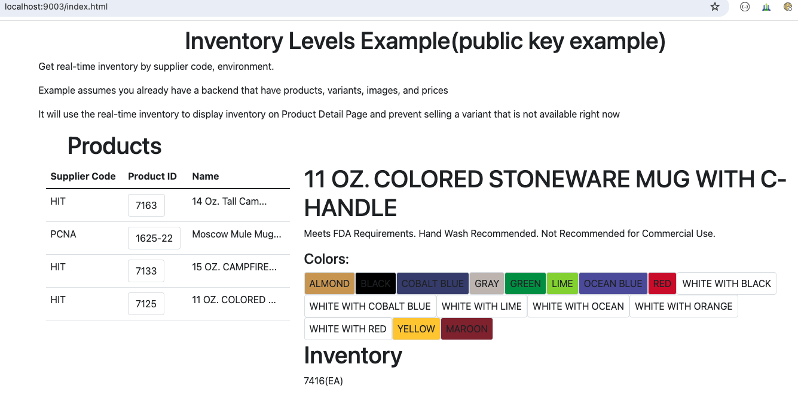
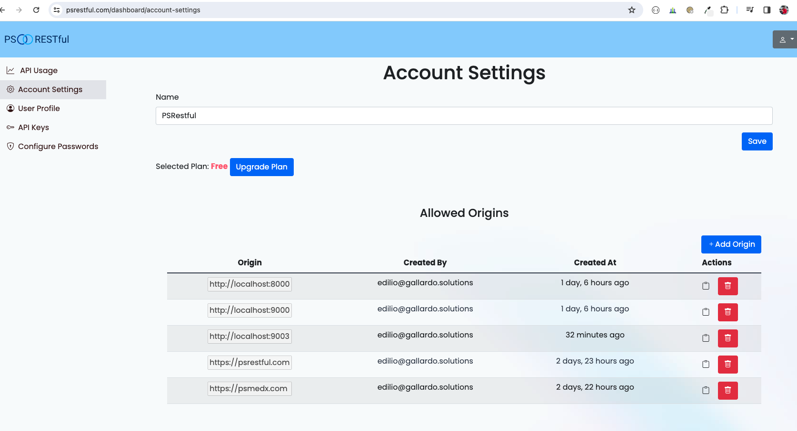
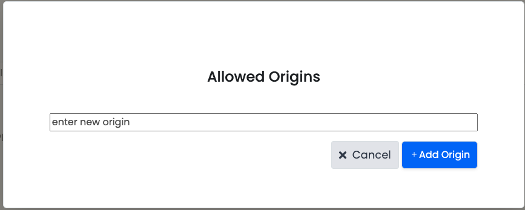

# Real-time Inventory Example using Public Key

This is a simple example of how to use `PSRESTful API` to check real-time inventory levels for a supplier implementing `PromoStandards`.

In this case, we are using the `Public Key` authentication method. As a Promotional Industry distributor, you can use this example to check real-time inventory levels for any supplier that implements `PromoStandards`.

## What is this code about?

In the left panel, you can see a list of products. When you click on a product, the right panel will show the different 
variants of the product. The list of product is really a variable in `JS` that we created using `Product Data Service`.

Then the user can click on the color variant and via ajax we get inventory levels for that product.

Please, remember to add the `https://host:port` combination to your account origin list in [PSRESTful](https://psrestful.com).

## How to run it?

```bash
python -m http.server 9003
```

## Key code snippets

### How to get the inventory levels for a supplier?

```javascript
function showInventory(productId, partId) {
        const product = products.find(product => product.productId === productId);
        const inventory = document.getElementById('inventory');

        $.ajax({
            url: `https://api.psrestful.com/v2.0.0/suppliers/${product.supplierCode}/inventory/${product.productId}`,
            type: 'GET',
            data: {
                "pub_api_key": '2f434bb853174a3cb1560883cd33601f',
                "environment": 'PROD'
            },
            headers: {
                'Content-Type': 'application/json',
                'Accept': 'application/json',
            },
            success: function (result) {
                const partInv = result.Inventory.PartInventoryArray.PartInventory.find(inv => inv.partId === partId);
                const qty = partInv.quantityAvailable.Quantity;
                inventory.innerHTML = `
                <h1>Inventory</h1>
                <p>${qty.value}(${qty.uom})</p>
                `;
            },
            error: function (error) {
                console.log(error);
            }
        });

    }
```

## Technologies used

- [Bootstrap](https://getbootstrap.com/)
- [JQuery](https://jquery.com/)

The main focus is about PSRESTful API, not the UI. So we used Bootstrap and JQuery to make the UI more user-friendly and don't raise the complexity of the example.

## Screenshots

### Example live at http://localhost:9003



### Example of list of allowed origins in [PSRESTful](https://psrestful.com/dashboard/account-settings)



### Add the `https://host:port` combination to your account origin list in [PSRESTful](https://psrestful.com)



